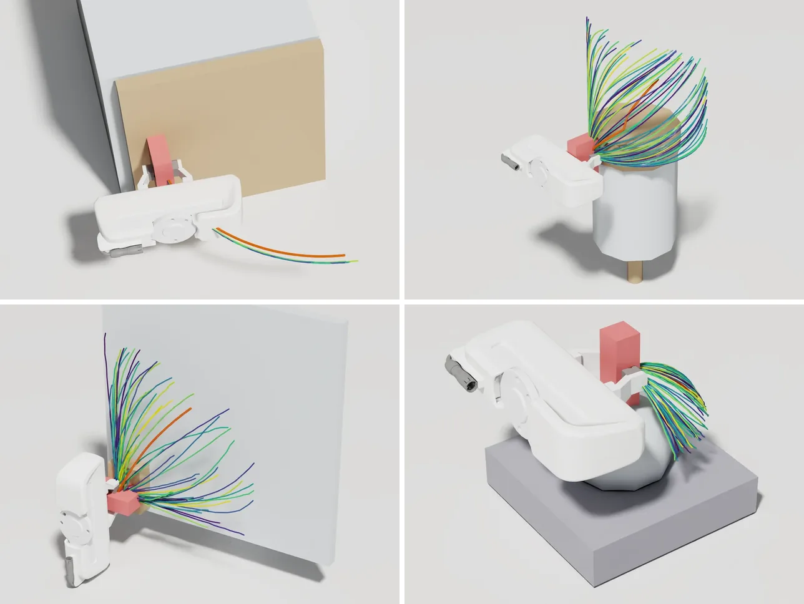

# Constraint-Decomposed Impedance Control from Generative Policy

Implementation of **"Constraint-Decomposed Impedance Control from Generative Policy for Articulated
Object Manipulation"** (CoRL 2026) and its simulation experiments.

[Project page](https://erickun0125.github.io/constraint-decomposed-impedance/)

<p align="center">
  
</p>
<p align="center"><em>Trajectory ensembles sampled by the policies at grasp closure on the four simulated
objects (revolute, cylindrical, planar and universal joints). Their spread spans the motions each object allows.</em></p>

A generative policy that manipulates an articulated object produces, from one observation, many
trajectories that differ but all respect the object's kinematic constraint. At grasp closure we sample
an ensemble of N trajectories, extract the end-effector body twists, and estimate the feasible twist
subspace by a weighted, uncentered PCA. The impedance gains are then made stiff along that subspace and
compliant along its complement, and held fixed while the policy drives the object. No object model,
force feedback or change to the policy is needed.

## Contents

| Path | What it is |
|---|---|
| `con_dec_imp/` | The method, independent of any simulator (numpy, torch) |
| `con_dec_imp/estimator.py` | Algorithm 1: ensemble of poses → twist matrix → feasible subspace → gains |
| `con_dec_imp/twists.py`, `subspace.py` | Body twists by SE(3) finite differences; characteristic length, weighted PCA and the dimension rule |
| `con_dec_imp/gains.py`, `impedance.py` | Inertia metric, metric-orthogonal projectors, Iso/Ours/Oracle gains; body-frame errors and feedback wrench |
| `con_dec_imp/metrics.py` | Evaluation metrics: ICF, PCF, ICM, PCM, load and feedback fractions, subspace error |
| `con_dec_imp/policy/` | Diffusion Policy inference (batched ensemble sampling), training dataset, pose-chunk actions |
| `con_dec_imp/settings.py` | Hyperparameters of the simulation experiments |
| `con_dec_imp_sim/` | Isaac Lab environments: flying gripper, four articulated objects, impedance action, contact wrench, scripted experts, reference subspaces |
| `examples/` | Notebook: Algorithm 1 on recorded trajectory ensembles, without the simulator or the policy |
| `scripts/` | Data collection, training, evaluation, scoring and tables |
| `configs/` | Policy training and data collection configurations |

## Installation

The simulation requires [Isaac Sim 5.1.0](https://docs.isaacsim.omniverse.nvidia.com/) and
[Isaac Lab](https://github.com/isaac-sim/IsaacLab). We used Isaac Lab at commit `3d42bff`
(included in release `v2.3.2`) in a conda environment with Python 3.11, PyTorch 2.7 and CUDA 12.8 on
an RTX 5070 Ti. Install Isaac Lab following its documentation, then, inside that environment:

```bash
git clone https://github.com/erickun0125/constraint-decomposed-impedance-control.git
cd constraint-decomposed-impedance-control
pip install -e ".[policy]"     # adds robomimic (commit 0ca7ce7), diffusers 0.11.1, huggingface-hub < 0.26 and h5py
python scripts/download_checkpoints.py
```

The method alone (`con_dec_imp`, without the policy and the simulator) needs only `pip install -e .`.
Run the unit tests with `pip install -e ".[test]"` and `pytest`.

## Using the method

```python
from con_dec_imp.estimator import ensemble_gains
from con_dec_imp.gains import inertia_metric
from con_dec_imp.policy.actions import GRIPPER_CLOSED_THRESHOLD, chunk_to_transforms

# chunks: (N, H, 10) absolute action chunks (position, 6-D rotation, gripper command) of N
# trajectories sampled by the policy from one observation, H waypoints 0.1 s apart
# (N = 128, H = 24 in the paper).
poses = chunk_to_transforms(chunks)                     # (N, H, 4, 4) end-effector poses
grasped = chunks[..., 9] > GRIPPER_CLOSED_THRESHOLD     # (N, H) waypoints commanding a closed gripper
metric = inertia_metric(rotational_inertia=0.00622, mass=0.586)   # block-isotropic inertia surrogate
K, D, estimate = ensemble_gains(poses, metric, grasped=grasped)
print(estimate.dim, estimate.basis())   # dimension and basis of the feasible twist subspace
```

`K` and `D` are the 6×6 stiffness and damping of the impedance law
`F_fb = K e_T + D e_V` in the end-effector body frame (`con_dec_imp.impedance`), with twists ordered
(angular, linear). The optional `grasped` argument marks the waypoints at which each sample commands a
closed gripper; only these enter the twist matrix, so motion that a sample still plans before grasping
is left out. The evaluation passes it. The thresholds and gains of the paper are the defaults in
`con_dec_imp/settings.py`.

`examples/data` holds one recorded ensemble per simulated object: 128 trajectories that the released
policy sampled at grasp closure, with the TCP and object poses at that instant. The notebook
[`examples/estimate_from_ensemble.ipynb`](examples/estimate_from_ensemble.ipynb) runs Algorithm 1 on
them step by step and plots each stage: the ensembles with the joint axes of the mechanism, the RMS
speeds of the principal directions against the dimension threshold, the comparison with the reference
subspace of the grasp, the decomposed stiffness, and its high-gain subspace drawn at the TCP on the
ensemble (linear part in blue, angular part in purple, as on the project page). It needs neither the
simulator nor the policy:

```bash
pip install -e ".[examples]"   # adds matplotlib and Jupyter
jupyter notebook examples/estimate_from_ensemble.ipynb
```

## Reproducing the simulation results

```bash
PYTHON="/path/to/IsaacLab/isaaclab.sh -p" bash scripts/run_paper_eval.sh checkpoints runs
```

This evaluates Iso, Ours and Oracle on the four objects with the per-object policies and with the
multi-task policy (100 trials each, 24 runs), scores every trial and writes `runs/tables.md` with the
paper's simulation table, the multi-task table and the diagnostics table (existing run directories under
`runs/` are overwritten). One run of 100 trials takes about 1 minute and about 7.5 GB of GPU memory on
an RTX 5070 Ti, and the full evaluation takes under 30 minutes. The three controllers on one object:

```bash
for controller in iso ours oracle; do
  python scripts/evaluate.py --object planar --controller $controller --checkpoint checkpoints/planar.pth \
      --out runs/single_task/planar/$controller --headless
done
python scripts/score.py runs/single_task/planar --out runs/scores_planar.jsonl
python scripts/make_tables.py --single_task runs/scores_planar.jsonl
```

The 100 trials of a run start from one batched reset whose default seed reproduces the initial object
configurations of the paper. Rendering on the GPU is not bit-reproducible, so the policy sees slightly
different images from run to run, and the results agree with the paper statistically rather than digit
for digit.

## Collecting demonstrations and training a policy

```bash
python scripts/collect_demos.py --object revolute --num_demos 400 --out datasets/revolute.hdf5 --headless
python scripts/train_policy.py --config configs/policy/single_task.json \
    --dataset datasets/revolute.hdf5 --out outputs/train/revolute
python scripts/export_policy.py outputs/train/revolute/model_epoch_250.pth --out checkpoints/revolute.pth
```

The scripted expert grasps the handle and drives the object through its feasible coordinates, with
randomized object poses and, for the multi-coordinate objects, randomized timing of each coordinate
(`con_dec_imp_sim/expert/`). For the multi-task policy, pass the four demonstration
files to `--dataset` with `configs/policy/multi_task.json`. The released policies are the checkpoints of
epoch 250 (revolute), 150 (cylindrical), 100 (planar) and 150 (universal) of 500, with validation every
10 epochs except for the universal policy, which was trained with `--validate_every 50`; the multi-task
policy is the checkpoint of epoch 400 of 2000, with validation every 200 epochs. Validation advances the
learning-rate schedule (see the docstring of `scripts/train_policy.py`), so the cadence matters.

## Citation

```bibtex
@inproceedings{park2026constraint,
  title     = {Constraint-Decomposed Impedance Control from Generative Policy
               for Articulated Object Manipulation},
  author    = {Park, Kyungseo and Lim, Byeongdo and Lim, Jungbin and
               Choi, Minseok and Park, Frank C.},
  booktitle = {Conference on Robot Learning (CoRL)},
  year      = {2026}
}
```

## License

MIT (see `LICENSE`). The gripper model contains meshes of the Franka hand from `franka_description`
under the Apache License 2.0 (see `NOTICE` and `licenses/`).
